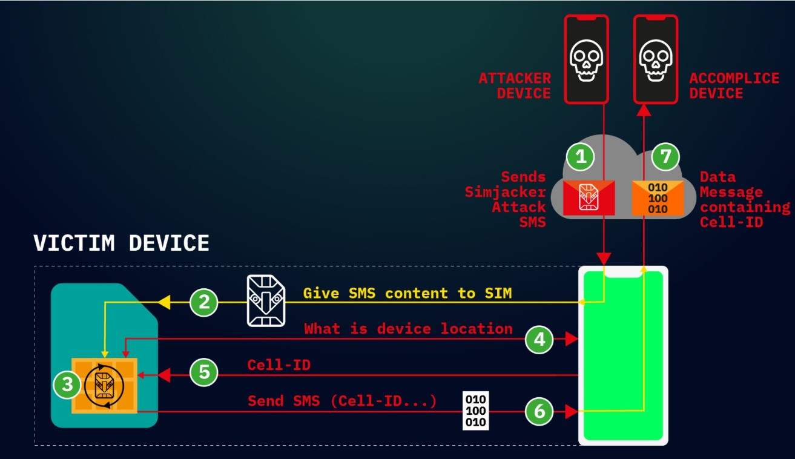

# Simjacker - A telecom software vulnerability enabling remote device control

## Introduction

Mobile phones use SIM Toolkit (STK) applications to perform sensitive tasks like getting location or sending messages, so these actions must be protected with proper authentication. When authentication is missing, attackers may trigger these powerful functions without the user ever knowing. This weakness is known as CWE-306: Missing Authentication for Critical Function, which is ranked #25 in the 2024 CWE Top 25 Most Dangerous Software Weaknesses. In 2019, this weakness appeared in SIM cards running the legacy S@T Browser, leading to the Simjacker (CVE-2019-16256) attack. Because the S@T Browser accepted unauthenticated binary SMS commands, attackers could remotely issue SIM Toolkit actions such as retrieving device location. This case study explains how this vulnerability occurred and why missing authentication made the attack possible.

## Software
  
**Name:** SIMalliance S@T Browser 
**Language:** Proprietary SIM/UICC firmware; interprets S@T Bytecode and TLV-encoded commands
**URL:** Not publicly available; built into SIM operating systems
https://trustedconnectivityalliance.org/wp-content/uploads/2020/01/S@T160.pdf
https://web.archive.org/web/20060427052032/http://www.ec-mobile.ust.hk/mobile/toolkit.htm


The S@T Browser is a SIM Toolkit application defined by the SIMalliance specifications. It runs inside the SIM card's firmware and does not use a traditional programming language. Instead, it interprets S@T Bytecode and TLV-encoded "S@T Push" messages, which it converts into SIM Toolkit (STK) commands executed by the mobile device. As described in the Simjacker technical report, "the S@T Browser can take commands via a Push message and then trigger SIM Toolkit actions on the device."

## Weakness

<a href="https://cwe.mitre.org/data/definitions/306.html">CWE-306: Missing Authentication for Critical Function</a>

This weakness happens when a system performs sensitive or high-privilege actions without first checking who is making the request. If there is no authentication, an attacker only needs to send a correctly structured message to trigger important functions that should normally be protected.



**Generic example (not from the S@T Browser):**

```
void handlePrivilegedMessage(Message *msg) {
    if (msg->type == CMD_PRIVILEGED) {
        //  No authentication check happening here!
        executePrivilegedAction(msg->action);
    }
}
```
The function never verifies the sender, anyone who can create a message of type `CMD_PRIVILEGED` can make the system run the privileged action.

The Simjacker research describes the same problem in the S@T Browser. As the report states:

```
"The S@T Browser allows S@T Push messages to be accepted without any authentication."
```

This lack of authentication is what allowed attackers to send malicious S@T Push commands and make the SIM perform powerful SIM Toolkit actions remotely.

## Vulnerability

<a href="https://www.cve.org/CVERecord?id=CVE-2019-16256">CVE-2019-16256</a> – Published 12 September 2019

The S@T Browser is designed to receive special binary SMS messages that contain `S@T Push` commands. According to the Simjacker technical paper, these messages use a proprietary TLV/SBC encoding format, contain instructions that the SIM executes as SIM Toolkit (STK) commands, and arrive as silent binary SMS messages (SMS-PP Download). Most importantly, they do not require any authentication. The report explains that this feature operates at a "zero-security level," meaning the SIM automatically trusts these messages even when they come from an unknown or malicious sender. This lack of verification is what allows attackers to craft their own S@T Push messages and make the SIM perform privileged actions remotely.

**Reconstructed vulnerable logic**

(This pseudocode is based only on the behavior described in the Simjacker technical paper. The actual SIM firmware is proprietary and not publicly available.)

```diff
void handleSatPushSms(uint8_t *pdu, size_t len) {

    if (!isSatPushFormat(pdu, len)) {
        return;  // Not an S@T Push message
    }

    SatPushMessage msg = parseSatPush(pdu, len);

-    // Vulnerability: 
-    // The S@T Browser does not authenticate who sent the message.
-    // According to the paper, it accepts S@T Push commands at "zero-security level".

    for (int i = 0; i < msg.commandCount; i++) {
        executeStkCommand(msg.commands[i]);  // Performs privileged SIM Toolkit actions
    }
}
```

The core problem is that the S@T Browser had fields for security, but did not actually enforce authentication.
As long as a message was correctly formatted as an S@T Push command, the SIM accepted it and executed it no matter who sent it.

**The research paper makes this clear:**
```
"Any attacker who can send an SMS… can trigger S@T Browser commands remotely."
```

This means a critical telecom component was performing privileged actions without verifying the sender, which is a complete breakdown of authentication and the direct cause of the Simjacker attack.

## Exploit

<a href="https://capec.mitre.org/data/definitions/21.html">CAPEC-21: Exploitation of Trusted Identifiers</a>

The Simjacker exploit works by sending a specially crafted binary SMS message that contains S@T Push commands. The attacker encodes a sequence of instructions, for example - "retrieve the device's location and send it back by SMS" using the S@T message format. The mobile network delivers this binary SMS silently to the victim's phone as an SMS-PP download, meaning the user never sees it. The phone then forwards the message to the SIM, where the S@T Browser parses its contents. Because there is no authentication, the S@T Browser automatically accepts the message as trusted and begins executing the included SIM Toolkit (STK) commands. These commands may request local information such as the device's location or cell ID, send an SMS containing the results, initiate a call setup, or launch the browser. Finally, the SIM instructs the device to send a response SMS back to the attacker with the requested data again without showing anything to the user. This entire sequence allows remote tracking or data extraction without installing malware or requiring any user interaction.

**Representative exploit payload**
The Simjacker technical analysis includes examples of S@T Push messages encoded as TLV/SBC sequences. The example below is a representative reconstruction, not the actual payload from any operator, and is included only to illustrate the structure.

```
// Example byte sequence constructed to mimic an S@T Push command.

uint8_t attackPdu[] = {
    0xD1, 0x10,        // TLV header and length
    0x02, 0x81, 0x03,  // STK command: Provide Local Information
    0x02, 0x00, 0x01   // Additional variable instructions
};
```

When such a PDU is delivered as a binary SMS to a vulnerable SIM, the S@T Browser treats it as a legitimate command sequence and executes the corresponding STK operations.

## Fix

SIMalliance issued practical mitigation guidance following disclosure of the Simjacker attack. They recommended that mobile operators deploy network-level filtering to detect and block illegitimate binary SMS messages before they reach subscribers' SIM cards. They also advised updating SIM configurations so that S@T Browser security settings do not allow the execution of unauthenticated S@T Push commands. These recommendations reflect the underlying security model described in the technical paper: remote STK command execution must only occur under authenticated, operator-controlled conditions. Enforcing message authentication in the firmware, combined with operator-side filtering and corrected SIM configurations, would prevent attackers from exploiting S@T Push messages to control devices remotely as seen in the Simjacker campaign.

**Reconstructed code-level fix**
Again, because the actual S@T Browser firmware is proprietary, the code below is a reconstructed secure model that illustrates the necessary checks based on the described behavior.

```diff
void handleSatPushSms(uint8_t *pdu, size_t len) {

    // Check if the SMS contains S@T Push content
    if (!isSatPushFormat(pdu, len)) {
        return;
    }

    SatPushMessage msg = parseSatPush(pdu, len);

+    // Require authentication (the paper explains that S@T Push
+    // messages can be secured but were deployed with "zero security").
    if (!verifySatPushAuthentication(msg)) {
+        return;  // Reject unsigned or invalid messages
    }

+    // Make sure the sender is allowed (operators only)
    if (!isAuthorizedSatSender(msg.source)) {
        return;
    }

+    // Execute only allowed STK commands
    for (int i = 0; i < msg.commandCount; i++) {
        if (!isAllowedStkCommand(msg.commands[i])) {
+            continue;  // Skip risky or unnecessary commands
        }
        executeStkCommand(msg.commands[i]);
    }
}
```

By enforcing authentication and command whitelisting, the SIM no longer accepts arbitrary remote instructions, preventing Simjacker-style remote control.

## Prevention

A key lesson from the Simjacker incident is that any system capable of carrying out remote commands must verify who is giving those instructions. Remote functions such as SIM Toolkit commands should never run unless the message comes from a trusted and authenticated source. Using "zero-security" settings, where features that support authentication are allowed to run without it, creates unnecessary risk and should be avoided entirely. The software on SIM cards should also be careful about which commands can be triggered remotely. Only safe, essential operations should be allowed, especially since some STK actions like retrieving location or sending SMS messages—can expose sensitive information.

Another important takeaway is that older or unnecessary components, such as outdated SIM Toolkit applications, should not remain active if they are no longer needed, leaving them enabled only increases the attack surface. It is equally important for operators and vendors to regularly test SIM profiles and SIM Toolkit applications using crafted binary SMS messages to make sure that unauthorized remote commands cannot slip through unnoticed. Finally, mobile networks should keep an eye on binary SMS traffic and use filtering to spot and block unusual or suspicious messages. This kind of monitoring can stop Simjacker-style attacks before they ever reach the user's device.

## Conclusion

Missing authentication for privileged operations is a well-known security weakness and is classified as CWE-306: Missing Authentication for Critical Function. When authentication is not enforced, systems may mistakenly trust commands that should only come from authorized sources. This weakness was the core issue behind the Simjacker vulnerability discovered in 2019. Because the S@T Browser accepted S@T Push messages without verifying who sent them, attackers were able to deliver hidden binary SMS messages that caused a victim's SIM card to run SIM Toolkit commands, including actions that revealed sensitive location information.

If the S@T Browser had required proper authentication and restricted which commands could be executed remotely, the underlying weakness would have been eliminated and the Simjacker attack would not have been possible. Strengthening authentication, reducing unnecessary legacy functionality, and applying focused security testing are essential steps for preventing similar vulnerabilities. Developers working with systems that process remote or privileged commands should ensure that strong authentication is always enforced so that untrusted inputs cannot trigger critical operations.

## References

CVE-2019-16256 Entry: https://www.cve.org/CVERecord?id=CVE-2019-16256
CWE-306 Entry: https://cwe.mitre.org/data/definitions/306.html
CAPEC-21 Entry: https://capec.mitre.org/data/definitions/21.html
NVD Vulnerability Report: https://nvd.nist.gov/vuln/detail/CVE-2019-16256
Simjacker Paper: https://info.enea.com/Simjacker-Technical-Paper?pk_vid=1e5d7a763edbf0f41764561819356267
S@T Documentation: https://trustedconnectivityalliance.org/wp-content/uploads/2020/01/S@T160.pdf
STK introduction: https://web.archive.org/web/20060427052032/http://www.ec-mobile.ust.hk/mobile/toolkit.htm

## Contributions

Originally created by Chandan Nanjundaswamy

(C) 2025 The MITRE Corporation. All rights reserved.<br>
This work is openly licensed under <a href="https://creativecommons.org/licenses/by/4.0/">CC-BY-4.0</a>


