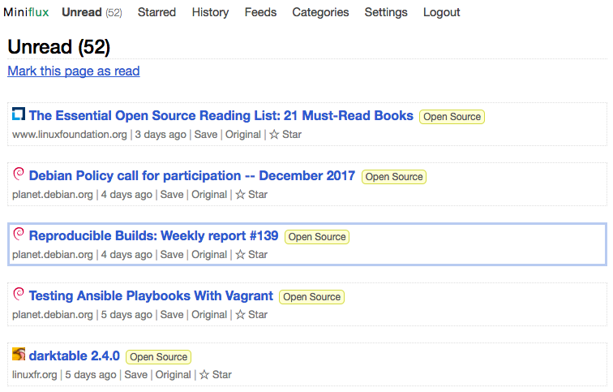

# MSCCS-10 :: CROSS-SITE SCRIPTING IN MINIFLUX

**Introduction:**
Website applications often need to respond to a requested action based on input provided by a user. If that response contains a copy of the user’s input without proper neutralization, then a dangerous attack known as Cross-Site Scripting (XSS) may be possible. The underlying weakness that leads to XSS is annually one of the CWE™ Top 25 Most Dangerous Software Weaknesses, ranking at #2 in 2023 and #1 in 2024. In 2023, such a weakness was discovered in Miniflux, a web feed reader. This case study will examine the weakness, the resulting vulnerability, what it allowed an adversary to accomplish, and how the issue was eventually mitigated.

**Language:** Go  
**Software:** Miniflux  
**URL:** https://github.com/miniflux/v2

**Weakness:** CWE-79: Improper Neutralization of Input During Web Page Generation

The weakness exists when a web application fails to properly neutralize user-controlled input in the web application's code, and the input is then used as part of a response to a user's request. 

There are three main kinds of cross-site scripting (XSS): reflected, stored, and DOM-based. This case study will focus on stored XSS, which is when a web application reads potentially dangerous input that was stored in a server-side location. This dangerous input is then read back into the application at some future time and included in a response that is sent back to the user. For example, an attacker could leave a comment on a forum that contains a malicious script. This comment is stored in the forum's back-end database, and then retreived anytime a user views the forum page.

**Vulnerability:** CVE-2023-27592 - Published 17 March 2023

Miniflux is a feed reader that supports Really Simple Syndication (RSS). Subscribing to an RSS feed can allow users to keep up to date on many different websites in a central hub without having to check each website manually. An RSS feed item is a single entry in the RSS feed that corresponds to an update from a website the feed is pulling from. Miniflux displays RSS feed items from a user's RSS subcscriptions in a central hub for users to view.

<br/><p align="center"></p><br/>

The vulnerability in Miniflux occurs in the function that controls how media (like images) from RSS is handled. The Miniflux server calls html.ServerError, which returns without adding the expected Content Security Policy (CSP) header that should be added to all HTTP responses. An example CSP is shown below.

```
Content-Security-Policy: default-src 'self';
```

A CSP is a set of instructions that a web browser follows to restrict actions the site can take. While a CSP can help in a variety of security scenarios, the main use case is to defend against XSS attacks by controlling what JavaScript a document loads. The example CSP above restricts the browser to only load resources that originate on the same website.

Looking at the proxy.go code, the vulnerable section begins at line 85 which is triggered if the Miniflux server encounters an error while processing the request. On line 86, the Miniflux server sends an HTTP Internal Server Error response to the user by calling the function html.ServerError, which includes an addition to the error log and builds the entry that will be added to the user's Miniflux inbox.

    vulnerable file: miniflux/v2/internal/ui/proxy.go

    23  func (h *handler) mediaProxy(w http.ResponseWriter, r *http.Request) {
    ...
    85      if err != nil {
    86		    html.ServerError(w, r, err)
    87		    return
    88      }
    ...
    118  }

Note that the ServerError function in html.go does not add a CSP header to the Miniflux entry that is built. As a result, when the mediaProxy function returns on line 87 above, the entry that is added to the user's Miniflux inbox has no restrictions on what JavaScript can be embedded in any media (like an image) within the RSS feed item, despite the user seeing an HTTP 500 Iternal Server Error. 

    vulnerable file: miniflux/v2/internal/http/response/html/html.go

    23  	// ServerError sends an internal error to the client.
    24  	func ServerError(w http.ResponseWriter, r *http.Request, err error) {
	25		    logger.Error("[HTTP:Internal Server Error] %s => %v", r.URL, err)
	26
	27		    builder := response.New(w, r)
	28		    builder.WithStatus(http.StatusInternalServerError)
	29		    builder.WithHeader("Content-Type", "text/html; charset=utf-8")
	30		    builder.WithHeader("Cache-Control", "no-cache, max-age=0, must-revalidate, no-store")
	31		    builder.WithBody(err)
	32		    builder.Write()
	33	} 

**Exploit:** CAPEC-63: Cross-Site Scripting

To exploit this vulnerability, an adversary starts by convincing a user to subscribe to an adversary-controlled RSS feed via Miniflux. Then, the adversary can craft an item for this RSS feed that contains an inline description with an  tag and a srcset attribute that uses an invalid URL that contains malicious JavaScript. An example RSS feed item is provided below.

```
<item>
  <title>Example RSS Feed Item</title>
  <link>https://example.com/item</link>
  <description>
    <![CDATA[
      <p>This is an example description with an image.</p>
      alert(1)</script>" alt="Example Image">
    ]]>
  </description>
  <pubDate>Tue, 10 Oct 2023 12:00:00 GMT</pubDate>
</item>
```

Notice the JavaScript contained in the srcset attribute. If the Miniflux user is subscribed to the adversary's RSS feed, the code in the mediaProxy function will reach the vulnerable section and add this RSS feed item to the user's Miniflux inbox. When the web browser loads the broken image, the malicious JavaScript is executed in the context of the victim Miniflux user. Actions will be performed on the Miniflux instance as the victim. If the victim is an administrator, administrative access to the Miniflux instance can be achieved. Actions that can be taken include but are not limited to the manipulation or theft of site cookies, a compromise of confidential information, the disclosure of end user files, the installation of Trojan horse programs, or redirection of the user to another site.

**Mitigation:**
To resolve this issue the source code was modified to remove the call to html.ServerError and thus prevent the Miniflux inbox entry from being built, replacing it with a logger error and an HTTP error on lines 86 and 87. 

    fixed file: miniflux/v2/internal/ui/proxy.go

    23  func (h *handler) mediaProxy(w http.ResponseWriter, r *http.Request) {
    ...
    85      if err != nil {
    86		logger.Error(`[Proxy] Unable to initialize HTTP client: %v`, err)
	87	        http.Error(w, http.StatusText(http.StatusInternalServerError), http.StatusInternalServerError)
    88		return
    89      }
    ...
    119  }

Now, the mediaProxy function does not build a Miniflux inbox entry like the earlier example and will instead simply log an error which avoids adding an RSS feed item to the user's inbox when this section of code is executed.

Additionally, a CSP was added to the header on line 29 of html.go to any Miniflux inbox entries that are built when ServerError is called. The CSP sets the default-src to 'self', which means that the browser will only load resources (like images) that originate from Miniflux.

	fixed file: miniflux/v2/internal/http/response/html/html.go

    23	// ServerError sends an internal error to the client.
    24	func ServerError(w http.ResponseWriter, r *http.Request, err error) {
	25		logger.Error("[HTTP:Internal Server Error] %s => %v", r.URL, err)
	26
	27		builder := response.New(w, r)
	28		builder.WithStatus(http.StatusInternalServerError)
	29		builder.WithHeader("Content-Security-Policy", `default-src 'self'`)
	30		builder.WithHeader("Content-Type", "text/html; charset=utf-8")
	31		builder.WithHeader("Cache-Control", "no-cache, max-age=0, must-revalidate, no-store")
	32		builder.WithBody(err)
	33		builder.Write()
	34	}

Now, even if a Miniflux inbox entry is built with an error response, a CSP will be utilized to defend against XSS attacks.

**Conclusion:**
Improper neutralization of input is a common weakness that annually ranks among the CWE™ Top 25 Most Dangerous Software Weaknesses, ranking #2 in 2023 and #1 in 2024. The weakness can lead to remote code execution and/or the reading of application data. One such weakness led to a vulnerability that was discovered in Miniflux in 2023. In response, Miniflux made changes to ensure that unneutralized input was not added to a user's RSS feed. Instead, an error would be logged, effectively mitigating the root weakness of “Improper Neutralization of Input During Web Page Generation”. Without this weakness, Miniflux can no longer be exploited in a stored XSS attack to execute JavaScript code on the Miniflux instance. Software developers should always follow secure coding practices and ensure any user-controlled input is effectively neutralized to avoid such vulnerabilities in their own projects.

**References:**

OSV Vulnerability Report: https://osv.dev/vulnerability/GHSA-mqqg-xjhj-wfgw

Miniflux Code Commit to Fix Issue: https://github.com/miniflux/v2/pull/1746/files

GitHub Advisory Database Entry: https://github.com/miniflux/v2/security/advisories/GHSA-mqqg-xjhj-wfgw

Miniflux Landing Page: https://miniflux.app/

Miniflux Documentation: https://miniflux.app/docs/configuration.html#proxy-images

CWE-79 Entry: https://cwe.mitre.org/data/definitions/79.html

Mozilla Documentation on Content Security Policies: https://developer.mozilla.org/en-US/docs/Web/HTTP/Guides/CSP

Mozilla Documentation on HTTP Status Codes: https://developer.mozilla.org/en-US/docs/Web/HTTP/Reference/Status