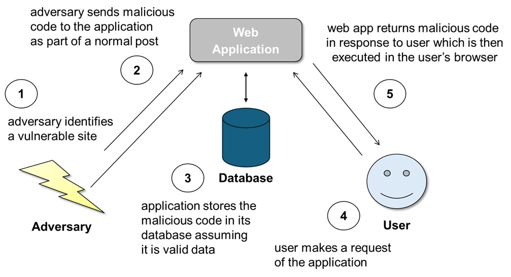

# MSCCS-11 :: CROSS-SITE SCRIPTING IN LIFERAY PORTAL

### Introduction:

Website applications often need to respond to a requested action using information obtained from a persitant datastore (e.g., database). If that information contains a copy of user provided input without proper neutralization, then a dangerous attack known as Cross-Site Scripting (XSS) may be possible. The underlying weakness that leads to XSS is annually one of the CWE™ Top 25 Most Dangerous Software Weaknesses, ranking at #2 in 2023 and #1 in 2024. In 2025, such a weakness was discovered in the notifications widget of Liferay Portal. This case study will examine the weakness, the resulting vulnerability, what it allowed an adversary to accomplish, and how the issue was eventually mitigated.

### Software:

**Name:** Liferay Portal  
**Language:** Java  
**URL:** https://github.com/liferay/liferay-portal

### Weakness:

<a href="https://cwe.mitre.org/data/definitions/79.html">CWE-79: Improper Neutralization of Input During Web Page Generation</a>

The weakness exists when a web application fails to properly neutralize user-controlled input in the web application's code, and the input is then returned to the user as part of the web application’s response.

There are three main kinds of cross-site scripting (XSS): reflected, stored, and DOM-based. This case study will focus on stored XSS, which is when a server-side application stores externally influenced input in a trusted data store and at a later time that potentially dangerous data can be read back into the application and included in dynamic content. For example, the server component of a web application may process a post by looking at the input parameters provided in the query string and store those parameters in its database (step 3 in the diagram below) for use later in generating a response to a different user’s reqeust that their browser will receive and process (step 5). If that response contains a copy of the adversary input, and if that adversary input contained malicious code embedded by an adversary (step 2 in diagram below), then that code will be executed by the user’s browser. A classic example is when an adversary posts a message in a bulletin board application and a different user makes a request to read that post.

 
send->store->request->reflect->execute">
 

The success of a stored XSS exploit does not depend on the type of web application or where the malicious data is stored. The adversary is looking for an application that will store their malicious data as is (i.e., without any neutralization) and then offer it up to an unsuspecting user whose browser will then execute that data.

### Vulnerability:

<a href="https://www.cve.org/CVERecord?id=CVE-2025-43807">CVE-2025-43807</a> – Published 22 September 2025

Liferay Portal is an open-source enterprise portal application for integrating information, people and processes across organizational boundaries. A cross-site scripting related weakness was identified in one of Liferay Portal's modules.

Within the change-tracking-web module, the _getMessage() method fails to properly neutralize a `name` parameter retrieved from a CTCollection. Looking at the vulnerable code, line 143 calls ctCollection.getName() to retrieve the value that has been stored in the portal database. This `name` is added without any nuetralization to the message object defined on line 142 and returned as part of the message on line 140. 

    vulnerable file: modules/apps/change-tracking/change-tracking-web/src/main/java/com/liferay/change/tracking/web/internal/notifications/PublicationInviteUserNotificationHandler.java

    92   private String _getMessage(
    93        UserNotificationEvent userNotificationEvent,
    94        ServiceContext serviceContext)
    95     throws Exception {
    ...
    102    CTCollection ctCollection = _ctCollectionLocalService.fetchCTCollection(
    103        ctCollectionId);
	...
    140    return _language.format(
    141      serviceContext.getLocale(), "x-has-invited-you-to-work-on-x-as-a-x",
    142      new Object[] {
    143        userName, ctCollection.getName(),
    144        _language.get(
    145            serviceContext.getLocale(), _getRoleLabel(roleValue))
    146      },
    147      false);

For this code weakness to be exploitable, two conditions must be met. First, the parameter `name` must be controllable by an adversary such that they can set the value to whatever they want. Second, the code must improperly neutralize (e.g., canonicalize, encode, escape, quote, validate) the adversary provided input such that the value is stored as is within the database.

*ADVERSARY CONTROLLED INPUT*

Regarding the first condition, there are multiple ways that an adversary can populate the `name` field in database such that it will later be retrieved by the vulnerable code. One example is by editing a publication via the `/change_tracking/edit_ct_collection` MVC command. This command is processed on line 49 of EditCTCollectionMVCActionCommand.java. The value of `name` to add is pulled from the request on line 60 and then passed to the add function on line 73.

    supporting file modules/apps/change-tracking/change-tracking-web/src/main/java/com/liferay/change/tracking/web/internal/portlet/action/EditCTCollectionMVCActionCommand.java
    
    49   protected void doProcessAction(
    50           ActionRequest actionRequest, ActionResponse actionResponse)
    51     throws IOException {
    ...
    59     long ctRemoteId = ParamUtil.getLong(actionRequest, "ctRemoteId");
    60     String name = ParamUtil.getString(actionRequest, "name");
    61     String description = ParamUtil.getString(actionRequest, "description");
    ...
    70       CTCollection ctCollection =
    71         _ctCollectionService.addCTCollection(
    72         null, themeDisplay.getCompanyId(),
    73         themeDisplay.getUserId(), ctRemoteId, name,
    74         description);

The addCTCollection() function is implemented in CTCollectionLocalServiceImpl.java on line 130. The adversary provided value for `name` is set on 154, and the ctCollection is saved in the database via the call to update() on line 159. Note that on line 135 the validate() funciton is called, but this

    supporting file modules/apps/change-tracking/change-tracking-service/src/main/java/com/liferay/change/tracking/service/impl/CTCollectionLocalServiceImpl.java
    
    130  public CTCollection addCTCollection(
    131          String externalReferenceCode, long companyId, long userId,
    132          long ctRemoteId, String name, String description)
    133    throws PortalException {
    134
    135    _validate(name, description);
    ...
    140    CTCollection ctCollection = ctCollectionPersistence.create(
    141        ctCollectionId);
    ...
    154    ctCollection.setName(name);
    ...
    159    ctCollection = ctCollectionPersistence.update(ctCollection);
    ...
    166    return ctCollection;
    167  }
    ...
    1580 private void _validate(String name, String description)
    1581   throws PortalException {
    ...
    1587   int nameMaxLength = ModelHintsUtil.getMaxLength(
    1588     CTCollection.class.getName(), "name");
    1589
    1590   if (name.length() > nameMaxLength) {
    1591     throw new CTCollectionNameException("Name is too long");
    1592   }

The database field that the `name` parameter is stored in is a 75 character string as defined by the SQL CREATE statement on line 102 of CTCollectionModelImpl.java.

    supporting file: modules/apps/change-tracking/change-tracking-service/src/main/java/com/liferay/change/tracking/model/impl/CTCollectionModelImpl.java
    
    102  public static final String TABLE_SQL_CREATE =
    103      "create table CTCollection (mvccVersion LONG default 0 not null,uuid_ VARCHAR(75) null,
             externalReferenceCode VARCHAR(75) null,ctCollectionId LONG not null primary key,companyId LONG,
             userId LONG,createDate DATE null,modifiedDate DATE null,ctRemoteId LONG,schemaVersionId LONG,
             name VARCHAR(75) null,description VARCHAR(200) null,onDemandUserId LONG,shareable BOOLEAN,
             status INTEGER,statusByUserId LONG,statusDate DATE null)";

*IMPROPER NEUTRALIZATION*

Regarding the second condition, there should be safeguards in the code to ensure that tainted input will not lead to undesired behavior. This is known as neutralization. There is no neutralization of the tainted input before or after it is saved in the database.

In this case, the value of the `name` parameter is obtained from the portal database via the call to getName(). The getName() function is located in CTCollectionModelImpl.java and returns the object value on line 606 without any neutralization.

    supporting file: modules/apps/change-tracking/change-tracking-service/src/main/java/com/liferay/change/tracking/model/impl/CTCollectionModelImpl.java

    599  @JSON
    600  @Override
    601  public String getName() {
    602    if (_name == null) {
    603      return "";
    604    }
    605    else {
    606      return _name;
    607    }
    608  }

### Exploit:

<a href="https://capec.mitre.org/data/definitions/63.html">CAPEC-63: Cross-Site Scripting</a>

To exploit this vulnerability, an adversary can 

### Fix:

To resolve this issue the source code was modified to include a form of neutralization. The change on lines 144 of the fixed PublicationInviteUserNotificationHandler.java file adds the use of HtmlUtil.escape() to neutralize (e.g., escape) specific charactures in the `name` parameter that carry specific meanings in the context of HTML markup before returning the value of ctCollection.getName() to the user.

    fixed file: modules/apps/change-tracking/change-tracking-web/src/main/java/com/liferay/change/tracking/web/internal/notifications/PublicationInviteUserNotificationHandler.java
    
    141    return _language.format(
    142      serviceContext.getLocale(), "x-has-invited-you-to-work-on-x-as-a-x",
    143      new Object[] {
    144        userName, HtmlUtil.escape(ctCollection.getName()),
    145        _language.get(
    146            serviceContext.getLocale(), _getRoleLabel(roleValue))
    147      },
    148      false);

The HtmlUtil.escape() function is defined by Liferay Portal within the file HtmlUtil.java. 

### Conclusion:

Improper neutralization of input is a common weakness that annually ranks among the CWE™ Top 25 Most Dangerous Software Weaknesses, ranking #2 in 2023 and #1 in 2024. The weakness can lead to remote code execution and/or the reading of application data. One such weakness led to a vulnerability that was discovered in the Liferay Portal in 2025. In response, Liferay Portal made changes to implement an effective neutralization of the user-controlled "name" parameter and remove the root cause weakness “Improper Neutralization of Input During Web Page Generation”. Without this weakness, the Liferay Portal code can no longer be exploited via a stored XSS attack to execute JavaScript code in a user's web browser. Software developers should always follow secure coding practices and ensure any user-controlled input is effectively neutralized to avoid such vulnerabilities in their own projects.

### References:

OSV Vulnerability Report: https://osv.dev/vulnerability/GHSA-jh9h-8xf2-25wj

GitHub Advisory Database: https://github.com/advisories/GHSA-jh9h-8xf2-25wj

CVE-2025-43807 Entry: https://www.cve.org/CVERecord?id=CVE-2025-43807

NVD Vulnerability Report: https://nvd.nist.gov/vuln/detail/CVE-2025-43807

CWE-79 Entry: https://cwe.mitre.org/data/definitions/79.html

CAPEC-63 Entry: https://capec.mitre.org/data/definitions/63.html

Liferay Portal Commit to Fix Issue: https://github.com/liferay/liferay-portal/commit/aaf32ff25affc0d63adc79abaedc9f565f033789

### Contributions:

Originally created by Drew Buttner - The MITRE Corporation 

(C) 2025 The MITRE Corporation. All rights reserved. 
This work is openly licensed under <a href="https://creativecommons.org/licenses/by/4.0/">CC-BY-4.0</a>
