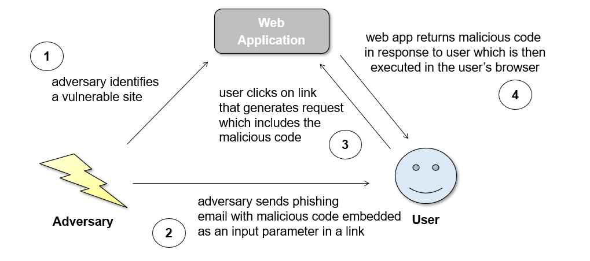

# MSCCS-8 :: Cross-Site Scripting In OpenC3 COSMOS

**Introduction:** Website applications often need to respond to a requested action based on input provided by a user. If that response contains a copy of the user’s input without proper neutralization, then a dangerous attack known as Cross-Site Scripting (XSS) may be possible. The underlying weakness that leads to XSS is annually one of the CWE™ Top 25 Most Dangerous Software Weaknesses, ranking at #2 in 2023 and #1 in 2024. In 2024, such a weakness was discovered in the login page of the open source edition of OpenC3 COSMOS. This case study will examine the weakness, the resulting vulnerability, what it allowed an adversary to accomplish, and how the issue was eventually mitigated.

**Language:** JavaScript  
**Software:** OpenC3 COSMOS (Open Source Edition)  
**URL:** https://github.com/OpenC3/cosmos

**Weakness:** CWE-79: Improper Neutralization of Input During Web Page Generation

The weakness exists when a web application fails to properly neutralize user-controlled input in the web application's code, and the input is then returned to the user as part of the web application’s response.

There are three main kinds of cross-site scripting (XSS): reflected, stored, and DOM-based. This case study will focus on reflected XSS, which is when the web application reads data directly from an HTTP request and "reflects" that data back to the user within the HTTP response. For example, the server component of a web application may process a request by looking at the input parameters provided in the query string (step 3 in the diagram below). The web application then typically generates a response that the user’s browser will receive and process (step 4 in the diagram below). If that response contains a copy of the original input, and if that original input contained malicious code embedded by an adversary (step 2 in diagram below), then that code will be executed by the user’s browser. A classic example is when an input is not valid and an error message is returned by the server showing the invalid value that was provided.

A common tactic adversaries use in reflected XSS exploits is to leverage a phishing attack. The adversary places malicious input into a URL with a hostname that appears valid and tricks a user into thinking the URL is legitimate. When a user clicks on the phishing URL, the request is sent to the web application which in turn generates a response that (if vulnerable) includes the malicious content which is then executed by the user's browser.

**Vulnerability:** CVE-2024-43795 – Published 2 October 2024

The vulnerability in OpenC3 COSMOS occurs when the login() method fails to properly neutralize a user input parameter. The user controlled `redirect` parameter is then used to specify what webpage to direct the user to.

    vulnerable file: openc3-cosmos-init/plugins/openc3-tool-base/public/js/auth.js

    37    login(redirect) {
    38        // redirect to login if we're not already there
    39        if (!/^\/login/.test(location.pathname))
    40        location = '/login?redirect=${encodeURI(redirect)}'
    41    }

To be vulnerable, two conditions must be met. First, the parameter `redirect` must be controllable by an adversary such that they can point the redirect to a location of their choosing. Second, the code must improperly neutralize (e.g., canonicalize, encode, escape, quote, validate) the adversary provided input such that the target location is not rejected.

*ADVERSARY CONTROLLED INPUT*

Regarding the first condition, the weakness in the source code relies on the parameter `redirect` being tainted. The string is initialized on line 145 of Login.vue, where it is received directly from the HTTP request’s query string and then stored as a constant. The `redirect` parameter is user-controlled because the "window.location.search" parameter refers to the search query part of a URL. An adversary can craft a custom phishing URL in which the search query part contains malicious JavaScript code.

    vulnerable file: openc3-cosmos-init/plugins/packages/openc3-tool-common/src/tools/base/components/Login.vue

    143    login: function () {
    144      localStorage.openc3Token = this.password
    145      const redirect = new URLSearchParams(window.location.search).get(
    146        'redirect',
    147      )
    148      window.location = decodeURI(redirect || '/')
    149    }

*IMPROPER NEUTRALIZATION*

Regarding the second condition, there should be safeguards to ensure that tainted input will not lead to undesired behavior. This is known as neutralization. There is no neutralization of the tainted input after it is initialized on line 145. As a result, an attacker could set the `redirect` string on line 145 to inject malicious JavaScript code and it would be accepted and passed into the decodeURI method on line 148.

**Exploit:** CAPEC-63: Cross-Site Scripting

To exploit this vulnerability, an adversary can craft a URL with a search query part containing malicious JavaScript code. For example, an adversary could craft a URL similar to the following:

    https://cosmos-host/login?redirect=javascript:alert(localStorage.openc3Token)

Anything following “redirect=” is stored into the "redirect" parameter in the source code on line 145. In this case, the user's password (which was stored in the openc3Token variable on line 144) would be displayed. The adversary crafted URL would then be sent to the user by some means, likely a phishing email. The URL would appear to be from a trusted source (the domain name would be of the trusted cosmos-host web application) and might fool a user into clicking the link. Once clicked, the malicious code would be sent to the server and subsequently reflected back to be executed in the user's web browser.

Looking deeper at the exploit for this specific vulnerability, the response sent back to the user sets the browser location to the malicious value. Using “javascript:” as the scheme part of the URL will cause some browsers to execute the JavaScript when the browser attempts to navigate to the location. This is known as a JavaScript URL. Some recent browsers have removed this functionality to guard against these types of exploits.

With more powerful scripts potential consequences include remote server-side code execution and the reading of application data such as passwords.

**Mitigation:**

To resolve this issue the source code was modified to include a form of neutralization. The changes on lines 148-153 of the fixed Login.vue file add a check of the contents of the "redirect" parameter before using it.

    fixed file: openc3-cosmos-init/plugins/packages/openc3-tool-common/src/tools/base/components/Login.vue

    143    login: function () {
    144      localStorage.openc3Token = this.password
    145      const redirect = new URLSearchParams(window.location.search).get(
    146        'redirect',
    147      )
    148      if (redirect[0] === '/' && redirect[1] !== '/') {
    149        // Valid relative redirect URL
    150        window.location = decodeURI(redirect)
    151      } else {
    152        window.location = '/'
    153      }

Line 148 add a check that the `redirect` parameter begins with one slash (“/”) and only one slash. This single slash as the first character in the search query of a URL is the syntax for directing to a local webpage. The presented exploit will no longer work because the first character in a valid "redirect" parameter is now required to be "/", meaning the `redirect` parameter will not be used if the first character is the "j" in "javascript". If the `redirect` parameter is invalid, the code moves to line 152 and the window.location value is set to the root path of the website.

**Conclusion:**

Improper neutralization of input is a common weakness that annually ranks among the CWE™ Top 25 Most Dangerous Software Weaknesses, ranking #2 in 2023 and #1 in 2024. The weakness can lead to remote code execution and/or the reading of application data. One such weakness led to a vulnerability that was discovered in OpenC3 COSMOS in 2024. In response, OpenC3 COSMOS made changes to implement an effective neutralization of the user-controlled "redirect" parameter and remove the root cause weakness “Improper Neutralization of Input During Web Page Generation”. Without this weakness, the OpenC3 COSMOS login page code can no longer be exploited in a reflected XSS attack to execute JavaScript code in a user's web browser. Software developers should always follow secure coding practices and ensure any user-controlled input is effectively neutralized to avoid such vulnerabilities in their own projects.

**References:**

OSV Vulnerability Report: https://osv.dev/vulnerability/GHSA-vfj8-5pj7-2f9g

CWE-79 Entry: https://cwe.mitre.org/data/definitions/79.html

Javascript URL Documentation: https://javascript.info/url

COSMOS Code Commit to Fix Issue: https://github.com/OpenC3/cosmos/commit/762d7e0e93bdc2f340b1e42acccedc78994a576e

NVD Vulnerability Report: https://nvd.nist.gov/vuln/detail/CVE-2024-43795

CVE-2024-43795 Entry: https://www.cve.org/CVERecord?id=CVE-2024-43795

GitHub Security Lab Report (GHSL-2024-128): https://securitylab.github.com/advisories/GHSL-2024-127_GHSL-2024-129_OpenC3_COSMOS/
